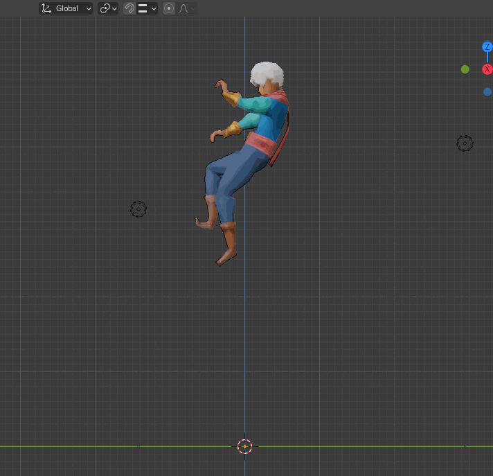
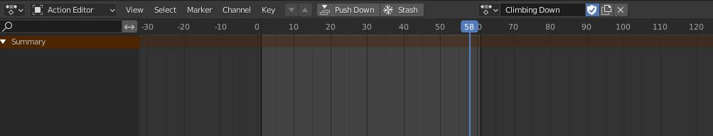
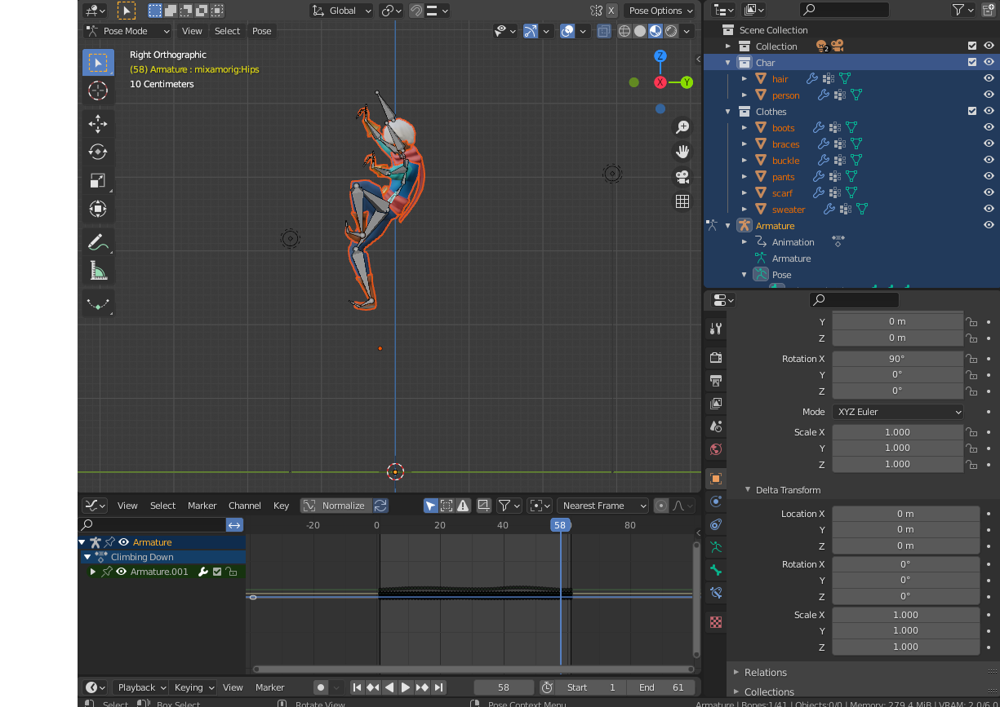
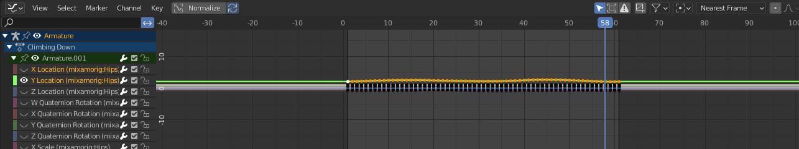
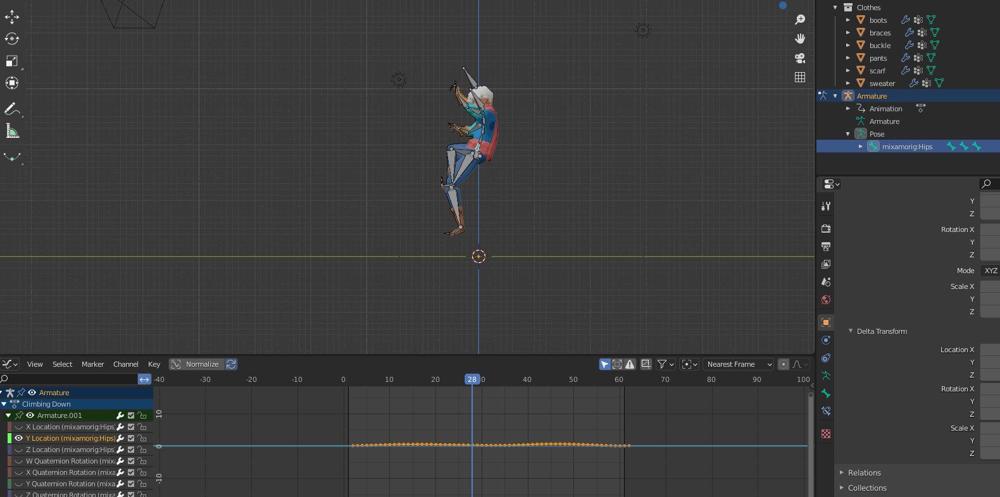

## Moving Armature animations in Blender

Recently tried to import an animation from Mixamo to Blender, and found the animation to be a bit higher than it should be.

As you can see this "climbing down" animation is way higher than the origin. Moving it down turned out to be less trivial than I thought. I found 2 different ways of doing it. 

1. Change Delta transformations
2. Use graph editor

I opted for (2) because the Delta transformations will change the "true" positions of these objects, and this also change all the animations. I have other animations in this project as well that I do not want to move.

### Steps 

First go to the dope sheet and ensure the right animation is selected: 

Next go to the Graph Editor. Select the Armature. 

Expand the armature on the left. This will let you see all the various _channels_. Changing these channels allows you to make transformational changes to the keyframes. For instance, here I want to move it down so I'm going to change the `Y Location` channel. To do this I will deselect all the rest : 

Next, press `A`  in the graph (make sure it's on the graph and not in the viewport), this will select all the keyframe points for this particular channel. Press `G` and move the cursor around to see the objects get moved for each frame. For me this is the end result: 

In a similar way you can adjust the scale, rotations, etc.

Done