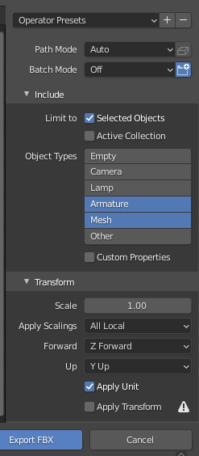
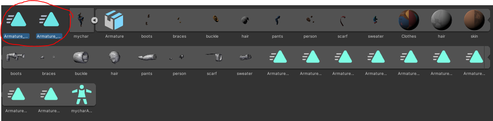

In this section I go over how you can take your character mesh in Blender, import it to Mixamo, get some animations, then add those animations in Blender without disrupting your existing Mesh's in Blender.

Table of Contents: 

- [Intro](##intro)
- [Importing animations into a fresh project](##importing-animations-into-a-fresh-project) 
- [Importing animations into a pre-configured project](##Importing-animations-into-a-preconfigured-project)
- [Add animation to Unity](#Add-animation-to-Unity)

## Intro

The first time we add animations will be a bit more involved, but once we're done setting up our workflow, adding new animations from Mixamo will become significantly easier.

Mixamo workflow boils down to: 

1. Export character from Blender in `obj` format
2. Upload this `obj` to Mixamo
3. Select an animation in Mixamo
4. Download animation in Mixamo, with skin selected 
5. Import downloaded `fbx` format into Blender
    a. If importing animation from Mixamo for the first time in this project, then set up vertex groups 
    b. If not importing for the first time, then clear everything that is not an animation 

We cover 1-4 and 5a in the first half of this tutorial. And 5b is covered in the end. 

## Importing animations into a fresh project 

We are going to take the following character from Blender and get some animations for it from Mixamo.

1. Select the objects, and export as OBJ, use default settings but check "Selection Only"
2. Import the OBJ into [mixamo](https://www.mixamo.com):
  - Upload the character
  - Apply joints
  - Select the appropriate animation
4. Click download, for the first object do it with skin (to get the weights) 

5. Import the downloaded fbx into Blender (with 100 scale)

I also check "Apply Transform" as it yields better results when trying to use the same armature for a different imported animation. The imported objects might look funky, but we won't be using these so I think it's not an issue. (If anyone knows why this happens please let me know, I still haven't figured it out).

#### Hook up Armature to existing objects

So what I want is the animation and vertex groups/weights. For the first animation I import, I keep the armature, but for the successive imports I'll clear their armatures.

I like to use my existing objects, this requires copying the vertex groups over from the imported armature.

In the image above you scan see the imported armature has their own instances of the original objects. I'll refer to the originals as OB (original objects) and armature's child objects as AB (armature objects). 

First add the modifier `Armature` to the OB's. Select the imported Armature for the `object` field in the modifier: 

Do this for all OB's. (Do this quickly by selecting all OB's and pressing ctrl+l in the viewport and selecting `modifiers`). 

Next, for each OB one by one do the following: 

  - Select OB
  - Select the matching AB (the selecting order is important)
  - go to vertex groups and select the arrow on the right
  - pick copy vertex groups to selected

Once done delete the objects under the armature.

### Importing animations into a preconfigured project

For our game character we probably wan't another animation. 

Download another animation from Mixamo, I've found it a bit bugging when importing "without skin", so I just keep the skin (but remove it later since we use our existing objects). 

Then import it just like before. This time you can delete this new Armature and it's child objects, keeping the animation.

Select the Dope Sheet > Action Editor panel, and rename the animations accordingly.

## Add Animation to Unity

Export the `fbx` as usual from Blender, and import the character to Unity. I use the following settings: 

Drag this character into your Unity project. The animations will be included in this file, you can click the arrow on the thumbnail to see them. Ensure that you follow the "Set up the Avatar" steps as described [here](https://docs.unity3d.com/Manual/ConfiguringtheAvatar.html) , usually I just need to set the `Animation Type` to `Humanoid` and click `apply`.

Next expand the character by clicking the little arrow on the thumbnail, select the animations and click `ctrl`+`d` . This will decouple the animations from the character.

