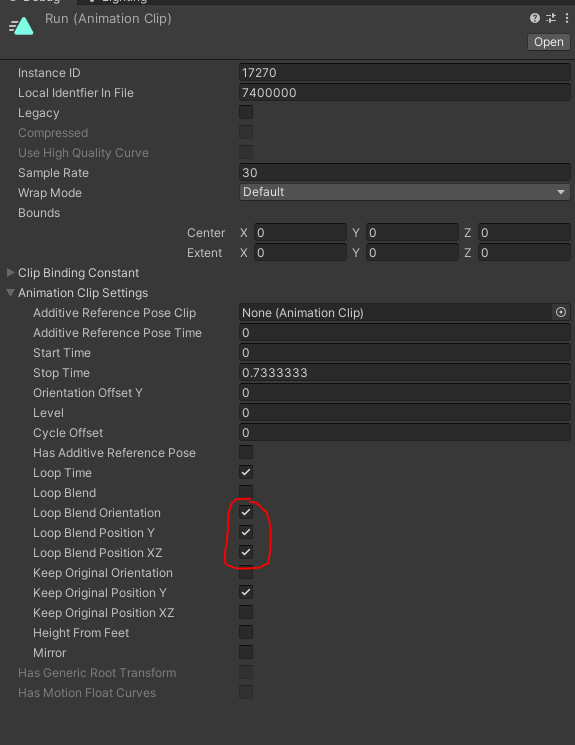
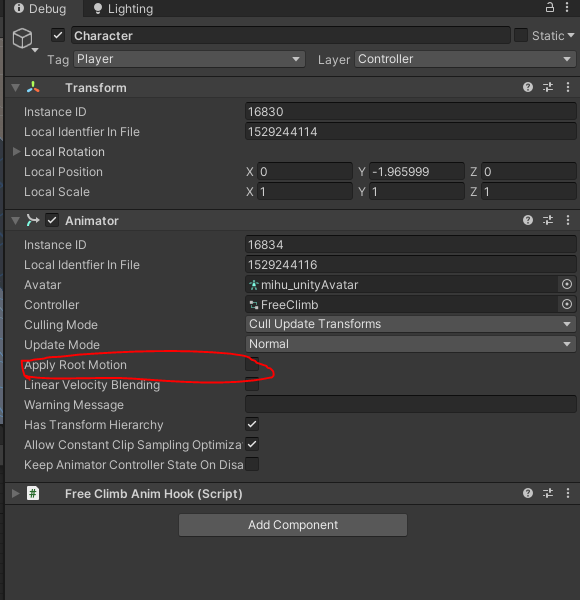

# FAQ 

This page is for small reminders/questions for myself that I'm bound to forget later and can refer back to. 

#### Table of Contents

- [Blended run animation is wobbly](##Blended-run-animation-is-wobbly ) 
- [Character moving unexpectedly due to animation](##Character_moving_unexpectedly due_to_animation)

## Blended run animation is wobbly 

Double click the blended animation and check the `Animation Clip Settings` . Ensure that the blend settings are correct. You might need to fiddle with the other settings as well. My run animation had issues wobbling side to side, so I had to enable the following to stabilize it so it would match what I saw in the animation preview: 

## Character moving unexpectedly due to animation

One of the causes for this is `Root motion` for the animator being enabled, you can disable this by going to the character animator component: 

