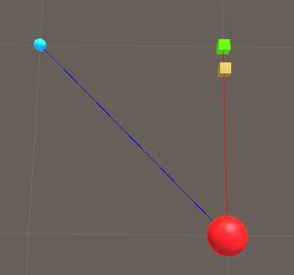

# Vector3 Basics (Position, Distance, Direction)

This document describes vectors from the perspective of unity.  We will cover vectors in 3D cartesian space. For unity this means [Vector3](https://docs.unity3d.com/ScriptReference/Vector3.html). 

Much of this is probably applicable to Vector2 as well.


### What is a Vector3?

A Vector3 can be thought of as a point in 3d space that comprises of both a direction and a magnitude. 

#### Direction

Try not to confuse direction with rotation, as these are different things. A vector has a direction, an object has a rotation. A direction for a vector can only be understood relative to another point in space. Let's take an example:

```c#
Vector3 playerOrigin = transform.position;
Vector3 direction = playerOrigin.normalized;
```

 In this example the [normalized](https://docs.unity3d.com/ScriptReference/Vector3-normalized.html) call gives the direction of the `player` from the world origin. Why world origin? Because remember that we are looking at the vector that is `transform.position`, the position of an object in this case is in world space, meaning everything is relative to the origin.

 `normalized` gives you a vector with a magnitude of 1. This basically means that the "distance" portion of the vector is stripped away. 


In the illustration above, the red is the origin, and the green cube is the player. Then `direction` from the code snippet above represents the arrow. 

#### Magnitude 

The magnitude of a vector can either be thought of as the distance or force. Let's think of them as distances for now. Like direction, distances are only meaningful relative to another point. 

```c#
Vector3 playerOrigin = transform.position;
float playerDistance = playerOrigin.magnitude;
```

Similar to distance, in this example the `magnitude` can be thought of as the distance of the player from the origin. This is illustrated below: 


Let's prove that we're right in this case by drawing a line from the origin (red sphere) to the player (green cube) by adding the following script to one of the objects: 

```c#
    public GameObject origin;
    public GameObject player;
    void Update()
    {
        Vector3 playerPos = player.transform.position;
        Vector3 originPos = origin.transform.position;

        Vector3 directionFromOriginToPlayer = playerPos.normalized;
        
        Debug.DrawRay(
            originPos,
            directionFromOriginToPlayer,
            Color.blue
        );
```

In this script we draw a line from the origin to the direction of the player, provided that `normalized` gives us this direction. Running the script results in: 


Indeed we get the results we expect. The blue ray is going from the origin to the direction of the player. But why is the line not connecting with the player? Remember that the `normalized` call simply returns another vector with a magnitude of 1, in this case magnitude represents distance, so the blue line only has a distance of 1. To fully connect this to the player, we need to incorporate the vector distance (magnitude) as well! 


```C#
        ... // same as before
        Vector3 directionFromOriginToPlayer = playerPos.normalized;
        float distanceFromOriginToPlayer = playerPos.magnitude;
        
        Debug.DrawRay(
            originPos,
            directionFromOriginToPlayer * distanceFromOriginToPlayer,
            Color.blue
        );
```

By multiplying the direction by distance, we are "scaling" the direction vector by that distance value, this can be conceptually thought of as _moving in that direction_. The amended code gives the following result: 


Success! Note that we will see the exact same results if we replace `playerPos` with `directionFromOriginToPlayer * distanceFromOriginToPlayer`. This is expected, since the whole point of the exercise is to show that the position vector3 is, in fact, comprised of these two properties: direction & distance. 

Note that both the `Magnitude` and `Distance` were extracted from the vector3 found from the `transform.position` . This means that the `transform.position` which is just a vector3 of the form (x,y,z) is more than just some point in space, but retains both these properties. But it's always important to remember that these properties only have meaning when considering another point in space (in this case the origin).  

#### Distance & Magnitude relative to another Object 

So far we have been considering only position relative to the origin for the player. But what if instead of the origin, we have a different object. In other words, what about another object relative to our player?  


In this new example we have another object, the blue cube. Let's call this blue cube the "enemy".  Looking at the illustration suggests, what if we want to calculate the distance from the player and the enemy? same with direction. Before, the distance/direction from origin to player was implicit by the call to `player.transform.position`. We can get a similar result for the enemy player by doing something like `enemy.transform.position` like so: 

```c#
    public GameObject enemy;
    public GameObject origin;
    public GameObject player;
    void Update()
    {
        Vector3 playerPos = player.transform.position;
        Vector3 enemyPos = enemy.transform.position;
        Vector3 originPos = origin.transform.position;
        
        Debug.DrawRay(
            originPos,
            playerPos, // now that we know playerPos is distance*direction (from origin) we can directly use playerPos
            Color.blue
        );
        
        Debug.DrawRay(
            originPos,
            enemyPos,
            Color.green
        );
```

This results in: 


Great, but we want to draw a line from the player to the enemy (blue cube). What happens if we simply add: 

```c#
        Debug.DrawRay(
            playerPos,
            enemyPos,
            Color.red
        );
```

Take a minute to think about why this won't work. 


Okay so let's see what happens if we run this: 


What is going on here? Remember that the second argument to [DrawRay](https://docs.unity3d.com/ScriptReference/Debug.DrawRay.html) takes a `direction`, but a direction is always relative to another point in space right? So we know from earlier `enemyPos` comes from `enemy.transform.position` and `position` of a transform contains the direction/distance relative to... the origin! So all we've done here is draw a line from the player in the direction of origin->enemy, which is why the red line is essentially _parallel_ to the green. 

What we need is to find the direction of the player to the enemy. This requires us to perform some Vector arithmetic. To get a direction of a vector A to vector B we need to subtract vector B from vector A i.e. `AB-> = B - A` . It' easier to explain why this works if we consider 2D vectors and the following diagram of a 2d cartesian space: 


I've kept the color scheme of the lines analogous to our example. The red vector, which is (3, -2) gives the direction from the point (2,4) to (5,2). Think of it it as the "steps" one needs to take to get to point (2,4) to (5,2). In this case we need to go 3 steps right, and 2 steps down from 2,4 to get to 5,2. If we instead subtract `(2,4) - (5,2)` then we get the reverse i.e. (-3, 2), 3 steps left, 2 steps up. Which is the vector moving from (5,2) in the direction towards (2,4). 

Let's use this new found knowledge in our example: 


```C#
        Vector3 playerToEnemy = enemyPos - playerPos;  

		// playerToEnemy is made up a direction and distance relative to the enemy
        Vector3 directionFromPlayerToEnemy = playerToEnemy.normalized;
        float distanceFromPlayerToEnemy = playerToEnemy.magnitude; 
        
        Debug.DrawRay(
            playerPos,
            directionFromPlayerToEnemy * distanceFromPlayerToEnemy,  // same as if we just put playerToEnemy
            Color.red
        );

```

This gives us the following result: 


And we get the intended result! 

# How to move an object in a given direction 

Earlier we encountered a scenario where we had to **scale** our `direction` by the `magnitude` (in this case also distance) to connect our lines between objects. *Scaling the direction* in this case allowed us to move the position along the direction we intended. Scaling is achieved by _multiplying_ a vector by some number, which we call  a `scalar`. 

When we were drawing our line from `player` to `enemy` , we needed three attributes: `playerPos`, `directionFromPlayerToEnemy`, `distanceFromPlayerToEnemy`. Then it was simply a matter of drawing a line from `playerPos` in the direction of `directionFromPlayerToEnemy` **scaled** by the distance of `distanceFromPlayerToEnemy`. The value `distanceFromPlayerToEnemy` in this case was our `scalar`. 

The same principle applies when we want to **move** an object in another direction. Consider the following scenario: 


Where red is our origin point in our world, green is our player, and blue is our enemy once again. I've kept the `DrawRays` to serve as visual aids (they are not directly relevant to this section however). Code is very similar to what we have been doing in the previous sections: 

```c#
Vector3 playerPos = player.transform.position;
Vector3 enemyPos = enemy.transform.position;
Vector3 originPos = origin.transform.position;

Debug.DrawRay(
    originPos,
    playerPos,
    Color.red
);

Debug.DrawRay(
    originPos,
    enemyPos,
    Color.blue
);
```


Suppose I wanted to move the player to where the enemy is? In order to do this, we need to move the player in the direction of the enemy but the distance between the two: 

```c#
// We first get out direction as before 
Vector3 directionFromPlayerToEnemy = (enemyPos - playerPos).normalized;

// This allows us to calculate the distance between player and enemy
float distanceBetweenEnemyAndPlayer = Vector3.Distance(playerPos, enemyPos);

// We now scale our direction by the distance, this vector now comprises of a direction + distance
Vector3 scaledDirectionByDistance = directionFromPlayerToEnemy * distanceBetweenEnemyAndPlayer;

// By adding this vector to player position, we move the player in the given direction by the distance
player.transform.position = playerPos + scaledDirectionByDistance;   
```


For the sake of this tutorial, we'll use a 2nd object to represent the `player` _after_ it has moved, so that we can see the old player position. Let's call this `futurePlayer`, and add it to our world like so: 




The yellow cube can be thought of as a "future" green cube. 

 We change our code to the following: 

```c#
    public GameObject enemy;
    public GameObject origin;
    public GameObject player;
    public GameObject futurePlayer;
	void Update()
    {
        Vector3 playerPos = player.transform.position;
        Vector3 enemyPos = enemy.transform.position;
        Vector3 originPos = origin.transform.position;
        
        Debug.DrawRay(
            originPos,
            playerPos,
            Color.red
        );
        
        Debug.DrawRay(
            originPos,
            enemyPos,
            Color.blue
        );
        
        Vector3 directionFromPlayerToEnemy = (enemyPos - playerPos).normalized;
        float distanceBetweenEnemyAndPlayer = Vector3.Distance(playerPos, enemyPos);
        Vector3 scaledDirectionByDistance = directionFromPlayerToEnemy * distanceBetweenEnemyAndPlayer;
        futurePlayer.transform.position = playerPos + scaledDirectionByDistance;        
    }
```

Running our code yields the following result: 


As you can see our `futurePlayer` has moved over to where the `enemy` is. 

Now suppose we don't want to move all the way to where the `enemy` is, we want to move only half way. How can we do this? 
We can reduce our scalar value by 50%: 

```c#
//...
        Vector3 directionFromPlayerToEnemy = (enemyPos - playerPos).normalized;
        float distanceBetweenEnemyAndPlayer = Vector3.Distance(playerPos, enemyPos);
        Vector3 scaledDirectionByDistance = directionFromPlayerToEnemy * distanceBetweenEnemyAndPlayer;
		// Reduce the scalar value by 50%, this will half the distance we travel in that particular direction
		scaledDirectionByDistance = scaledDirectionByDistance * 0.5f;
        futurePlayer.transform.position = playerPos + scaledDirectionByDistance;    
```

This gets us the following result: 


Note that the yellow cube representing our `futurePlayer` is now permanently situated between our old `player` and the `enemy`. 

Also note that: 

```c#
Vector3 directionFromPlayerToEnemy = (enemyPos - playerPos).normalized;
float distanceBetweenEnemyAndPlayer = Vector3.Distance(playerPos, enemyPos);
Vector3 scaledDirectionByDistance = directionFromPlayerToEnemy * distanceBetweenEnemyAndPlayer;
scaledDirectionByDistance = scaledDirectionByDistance * 0.5f;
futurePlayer.transform.position = playerPos + scaledDirectionByDistance;  

// is equivalent to running: 
futurePlayer.transform.position = playerPos + (enemyPos - playerPos) * 0.5f;    
```

The reason is very similar to the previous section. Recall that a `position` is comprised of a `direction` and `magnitude` (in this case distance) relative to another position (in this case the enemy). By subtracting `enemyPos` from `playerPos` we are not only getting the direction from `player` to `enemy`, but we're also getting the `distance`. The way we initially did things is actually counter intuitive in practice, as we're stripping the same information away from the positions that we are then adding back in later by recalculating the distance.
